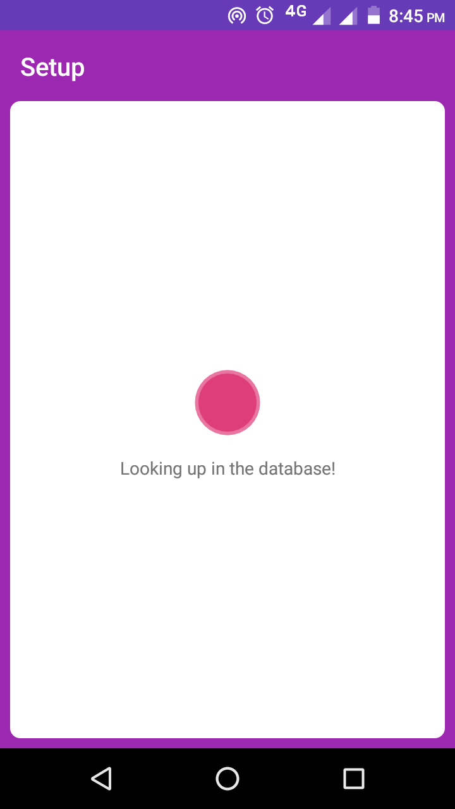
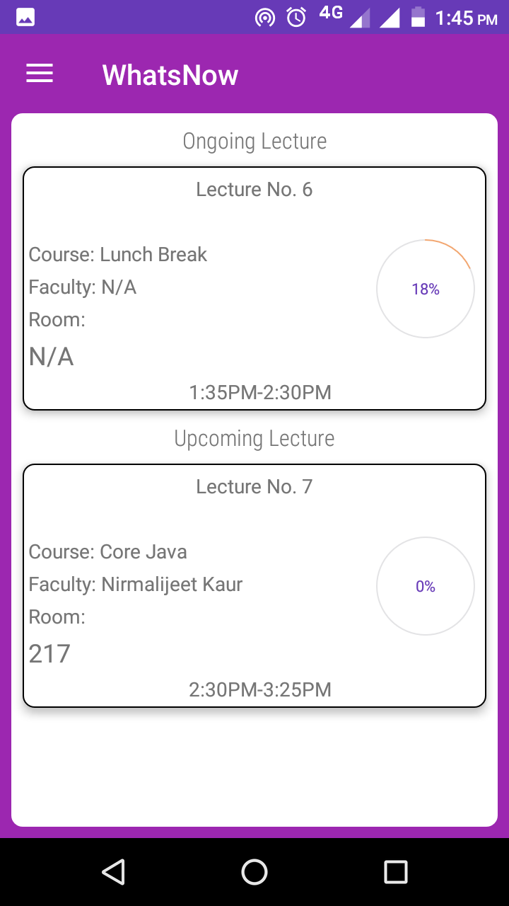
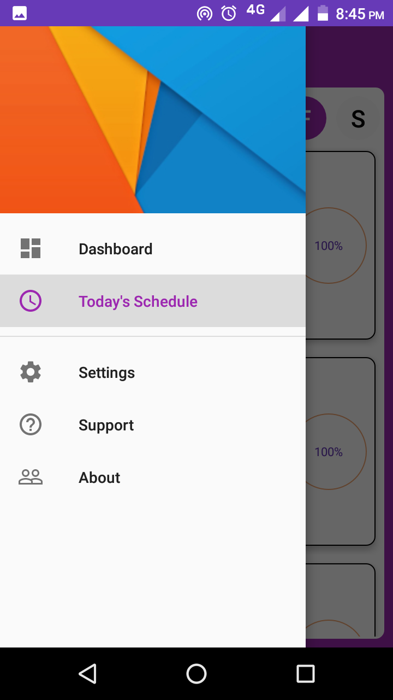
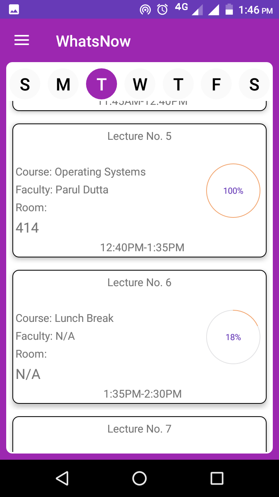
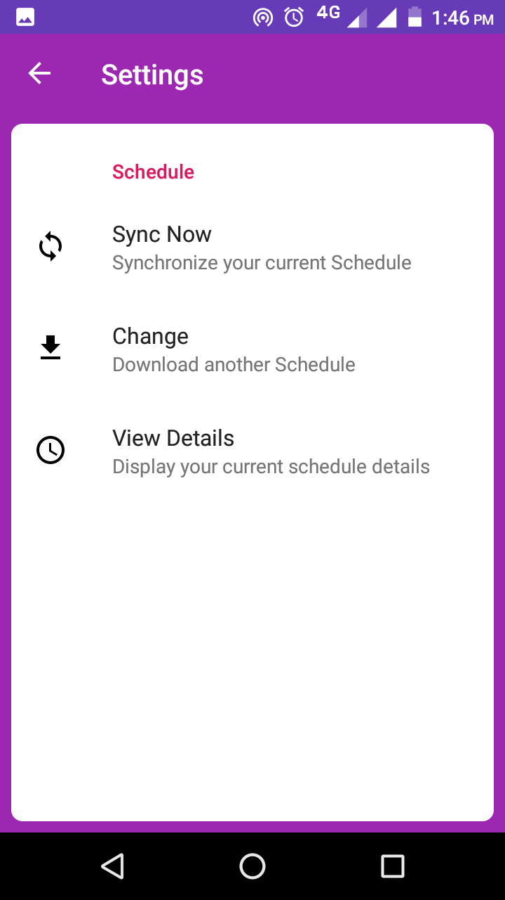

# WhatsNow
App For Viewing Schedules

# Description
This app helps to view your schedules in a modern fashion with 
A beautiful  dashboard consisting of current and next lectures 
And a Day-wise full scheule viewer for ease of access. 

<b>Unfortunately, It only supports my personal college schedules.</b> 
<b>All Firebase services of this app has been terminated.</b> 
<b>You are free to use this for your own schedules with your own Firebase Services.</b>

# Prerequisites
1. Java 
2. Android Studio 
3. Android SDK 

# Installing
1. Download or Clone the Project.  
2. Build the project with Andriod Studio.

# Built With
Java 
Android Studio 
Android SDK 
Firebase 
Gson

# Author
Arnab Maji

# License
This project is licensed under the MIT License.

# Screenshots

